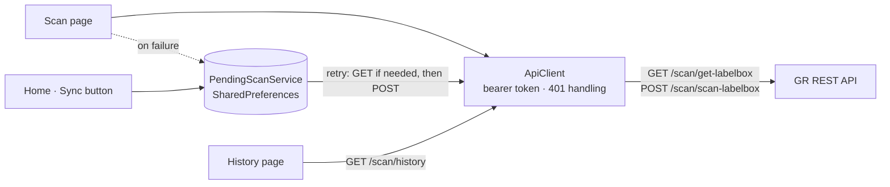

<div align="center">

# 📥 GR Scanner

**Goods Receipt (GR) scanning app that keeps working offline: scan delivery box labels, post the receipt, and sync anything left over once the network is back.**


</div>

---

## Overview

When supplier deliveries arrive, every box label on the delivery note (DN) has to be scanned so the goods receipt is recorded in the system. Receiving docks often have weak Wi-Fi, and a scan that silently fails means stock that was received but never booked.

**GR Scanner** is built around that problem: **no scan is ever lost**. When the server can't be reached, the scan is saved on the device and synced later, and the operator can always see what is still waiting.

## Features

- **Camera barcode scanning** of box labels, with a success modal that pauses the camera so the same label isn't read twice
- **Two-step receipt**: `GET` the box-label data, reject labels that were already received, then `POST` the receipt automatically
- **Offline pending queue** (`PendingScanService`):
  - *Partially offline*: the lookup worked but the post failed. The full label data is stored and only the post is retried.
  - *Fully offline*: only the barcode and employee ID are stored. On sync, the app looks the label up first, then posts it.
  - One entry per barcode (deduplicated), kept in app-internal storage, so no storage permission is needed.
- **Home dashboard**: recent scans, pending count and a one-tap **Sync** button
- **History** with search and date-range filters
- **Token authentication**: a central HTTP client adds the bearer token, and on `401` it clears the session and routes back to login
- **Robust parsing**: handles single-object or list responses and non-JSON error pages (HTML 404/500) without crashing

## Architecture



```
lib/
  core/
    constants/  API base URL
    services/   api_client (auth, errors), pending_scan_service (offline queue)
  features/
    splash · auth (login) · home (dashboard + sync) · scan · history
  shared/widgets/  app drawer
```

## Tech Stack

| Area | Packages |
|---|---|
| Framework | Flutter, Dart |
| Scanning | `mobile_scanner` |
| Networking | `http` |
| Local storage | `shared_preferences` (session and offline queue) |

## Getting Started

```bash
flutter pub get
flutter run
```

Set the backend URL in [`lib/core/constants/api_constants.dart`](lib/core/constants/api_constants.dart). The app expects `/login`, `/logout`, `/scan/get-labelbox`, `/scan/scan-labelbox` and `/scan/history`.

## Related

- [**my_armada**](https://github.com/efrino/my_armada): warehouse scan-in, scan-out and stock-taking app
- [**sto**](https://github.com/efrino/sto): stock-taking tag printing and counting on handhelds

## Author

**Efrino Wahyu Eko Pambudi**: [GitHub](https://github.com/efrino) · [LinkedIn](https://www.linkedin.com/in/efrinowep/) · [Portfolio](https://efrino.netlify.app)
